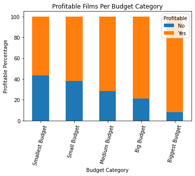
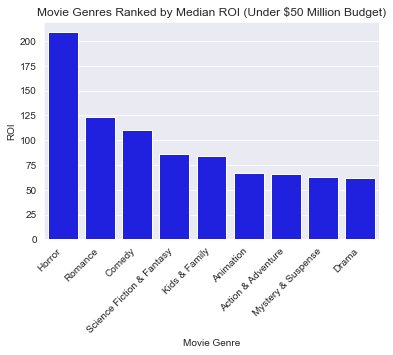
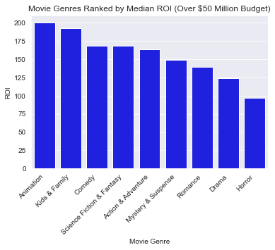
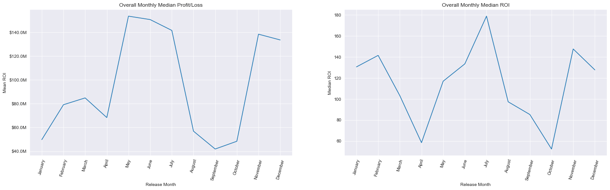

# Microsot Movie Project Analysis

**Authors**: Sean Hart

## Overview

This project is to create reccomendations for a possible Mircrosoft movie studio. Descriptive analysis of film financial data shows that bigger budgets movies offer a greater percentage of positive Return-on-Investment. Data shows summer months are the time of best return. Animation offers the best return for big budget movies.

## Business Problem

A new movie studio will have to make determinations on budget, type-of-films, and a release schedule. 

## Data

"The Numbers" financial data  provided production budget and gross information for 5,782 film entries. This data was paired with data from Rotten Tomatoes provided genre information as well.

## Methods

This project uses descriptive analysis, a look at monthly trends and a look at categorical evaluations.

## Results

Subdividing films into budget tiers revealed the greatest percentage of profitable films above $60 Million. This category had the highest correlation of production budget to ROI. 

### Visual 1

The return on investment varies month-to-month, it also varies when divided into budget tiers. 

### Visual 2

Film genre also offers another decision point for a potential studio. Animation is the top genre amongst big budget films. Horror offers the highest ROI amongst smaller budget films. Drama is a category to be avoided.

### Visual 3

## Conclusions

* Target the traditional summer months for big budget releases. Look for oppurtunities in early months for smaller budget films.
* Look to bigger budget films for the best chance of securing a positive return.
* Invest in a big budget animation studio, do not ignore horror as a place to turn small dollars into a high rate of return.
***

## Next Steps
* Information on streaming data and its effect on the theatrical landscape.
* This project focused on production budget, other factories such as marketing and advertising should be considered.
* What about other sources of revenue for movies that have an IP universe. 
## For More Information

Please review our full analysis in [our Jupyter Notebook](./microsoft_movie_studio_analysis.ipynb) or our [presentation](./Sean_Hart_Microsoft_Movie_Presentation.pdf).

For any additional questions, please contact **Sean Hart at seanmhart@gmail.com**

## Repository Structure
